# GitとGitHubの環境構築をしよう

1. [Gitのインストール](#gitのインストール)<br>
1. [Gitの初期設定](#gitの初期設定)<br>
1. [GitHubのアカウントを作成](#githubのアカウント作成)<br>

## Gitのインストール

[公式サイト](https://gitforwindows.org/)からGitをダウンロード

### Gitのインストール手順

1. インストーラーの実行<br>
(実行には管理者権限が必要です。)

1. ライセンス確認<br>
([Next]ボタンを押します。)<br>
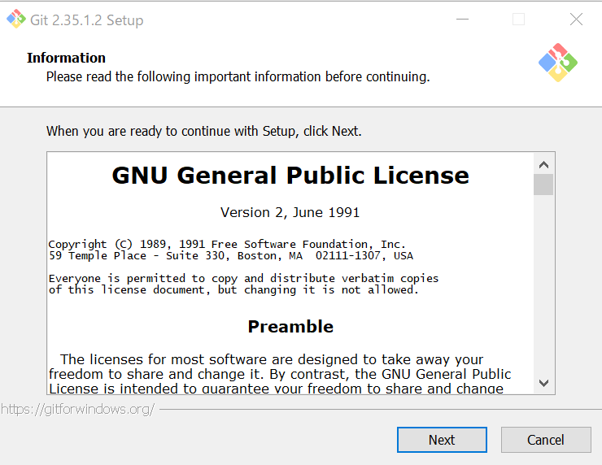

1. インストール先の選択<br>
(特に理由がない限り変更の必要はありません。)<br>
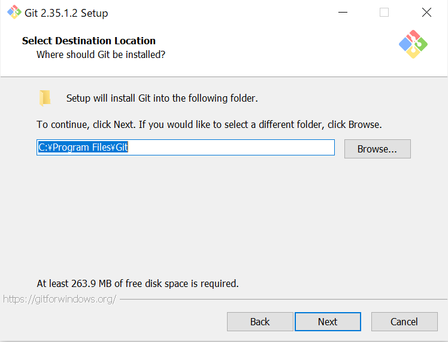

1. オプションの選択<br>
(好みで選択してください)<br>
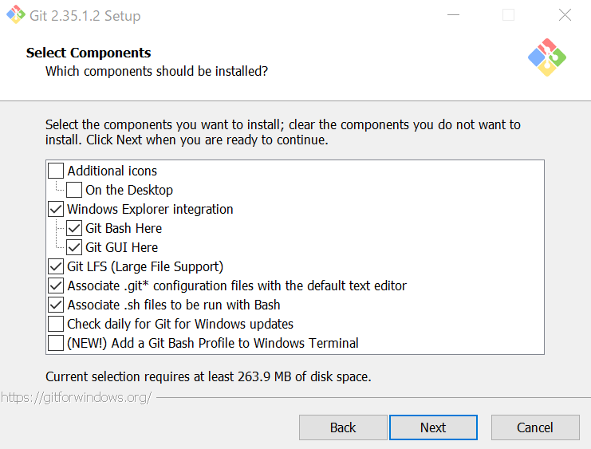
### オプションの種類と内容
>  * Additonal icons
>    * On the Desktop (デスクトップにGitアイコンを追加)
>  * Windows Explorer integration (エクスプローラーの右クリックメニューにGitを起動するためのメニューが追加されます。)
>    * Git Bash Here (Git Bash(Git用のシェル)が起動します。)
>    * Git GUI Here (Git GUI(GUI版のGit)が起動しま>す。)
>  * Git LFS (Large File Support)<br>
>  (Git LFS がインストールされます。Git は大容量ファイルを扱うのが苦手です。その欠点を補うために開発されたのが Git LFS です。インストールすると、[git lfs] コマンドが使用できるようになります。)
>  * Associate .git* configuration files with the default text editor<br>
>  エクスプローラーで「.git」で始まるGit関連のファイルをダブルクリックすると、テキストエディタが起動するようになります。
>  * Associate .sh files to be run with Bash<br>
>  エクスプローラーで拡張子が「.sh」のファイルをダブルクリックすると、Git Bashが起動して実行されるようになります。
>  * Check daily for Git for Windows updates<br>
>  最新の Git for Windows が公開されたとき、通知され るようになります。
>  * Add a Git Bash Profile to Windows Terminal<br>
>  Windows Terminal に Git Bash が追加されます。<br>
<br>

5. スタートメニューの選択<br>
スタートメニューへの追加先を選択します。<br>
スタートメニューへ追加したくない場合は「Don't create a Start Menu folder」にチェックを入れます。<br>
(スタートメニューとは、Windowsアイコンをクリックして出てくるメニュー)<br>
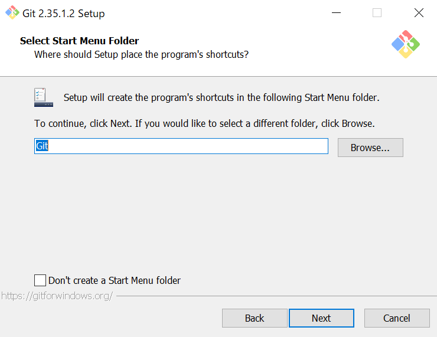

1. テキストエディターの設定<br>
コミットメッセージ等の入力に使用する、テキストエディターを選択します。<br>
Git Bash や コマンドプロンプト、PowerShell などでメッセージ入力が必要なGitコマンドを実行すると、選択したエディターが起動します。<br>
(新人研修ではデフォルトのVimのみ使い方を紹介します。)<br>
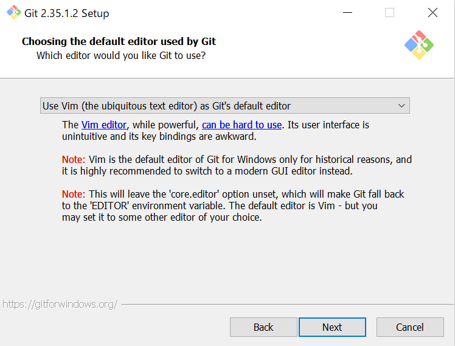
<br>

7. 新しいリポジトリ作成時のブランチ名<br>
「git init」コマンドでリポジトリを作成したとき、最初に作成されるブランチ名を指定します。<br>
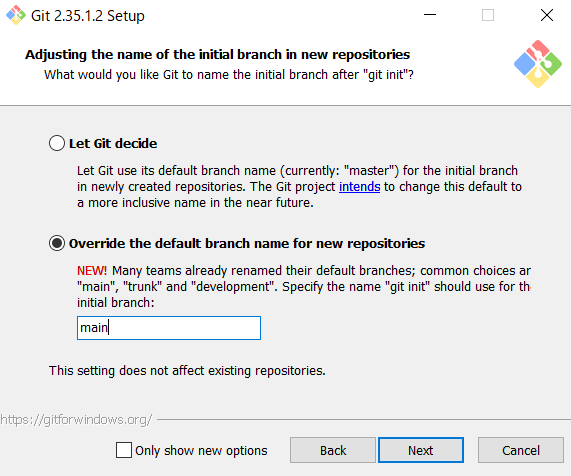

### 選択肢とその説明
>  * Let Git decide<br>
>  デフォルトのブランチ名を「master」にします。
>  * Overrride the default branch name for new repositories<br>
>  デフォルトのブランチ名を、指定したブランチ名に変更します。<br>
>  (新人研修ではmainで説明します。)<br>
>    * Q.なぜmainにするのか？<br>
>      A.同じくしようするGithubではmainがデフォルトで使われているから。

8. 環境変数パスの設定<br>
Windows の PATH環境変数に追加するフォルダを選択します。<br>
(デフォルトの状態でOK)<br>
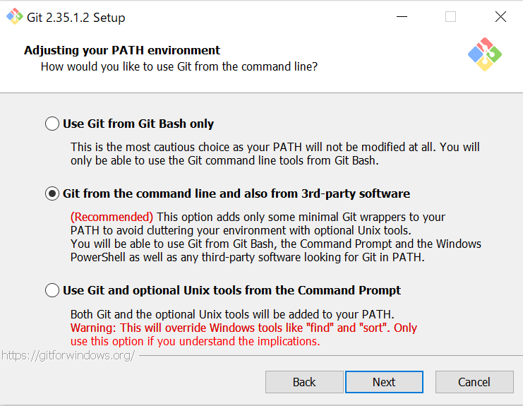

### 選択肢とその説明
> * Use Git from Git Bash only<br>
> GitBashでのみGitを使用できる<br>
> PATH には何も追加されない<br>
> * Git from the command line and also from 3rd-party software<br>
> GitをDOSプロンプトやPowerShellでも使用可能<br>
> PATHにGitインストール先\Git\cmdが追加される<br>
> * Use Git and optional Unix tools from the Windows Command Prompt<br>
> DOSプロンプト や PowerShell で Unix のコマンドが使える<br>
> PATHに以下のフォルダが追加される<br>
>   * Gitインストール先\Git\cmd
>   * Gitインストール先\Git\mingw64\bin
>   * Gitインストール先\Git\usr\bin

9. ssh.exe ファイルの選択<br>
(デフォルトの状態でOK)<br>
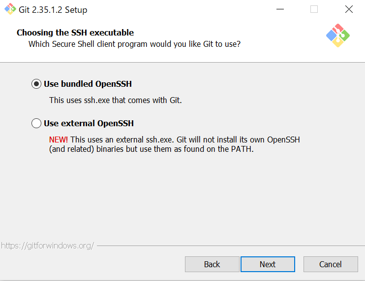
### 選択肢とその説明
> * Use bundled OpenSSH<br>
> ssh.exe をインストール
> * Use external OpenSSH<br>
> ssh.exe をインストールしない<br>
> PATH環境変数に ssh.exe のパスが通っている必要がある

10. HTTPSの設定
リモートリポジトリに接続する際の設定です。<br>
(デフォルトの状態でOK)<br>
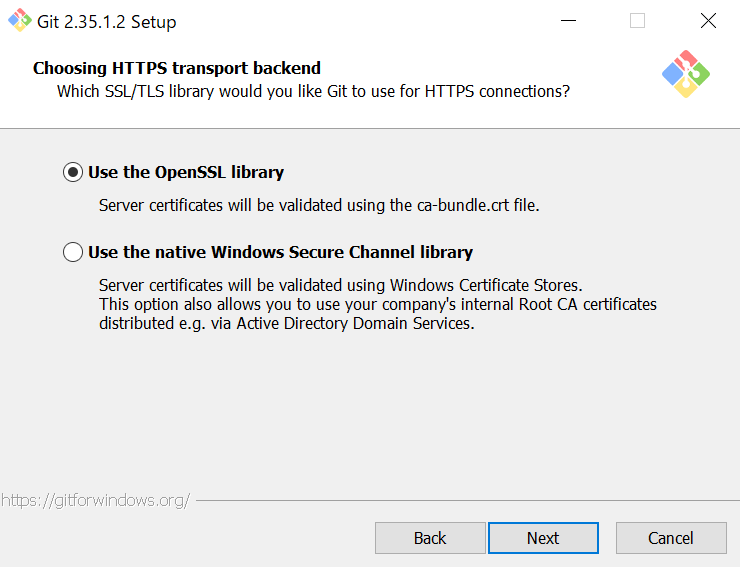

###  選択肢とその説明
> * Use the OpenSSL library<br>
> HTTPS接続の検証にOpenSSLのルート証明書を使用<br>
> * Use the native Windows Secure Channel library<br>
> HTTPS接続の検証にWindows証明書ストアのルート証明書を使用

11. 改行コードの設定<br>
チェックアウト・コミット時に、改行コードを自動変換するか設定します。<br>
(デフォルトの状態でOK)<br>


### 選択肢とその説明
> * Checkout Windows-style, commit Unix-style line endings<br>
> 改行コードがチェックアウト時に「CR-LF」、コミット時に「LF」に自動変換される<br>
> Checkout as-is, commit Unix-style line endings<br>
> 改行コードがコミット時に「LF」に自動変換される<br>
> Checkout as-is, commit as-is<br>
> 改行コードの自動変換をしない<br>

12. ターミナルの設定<br>
Git Bashで使用するターミナルを選択します。<br>
(デフォルトの状態でOK)<br>
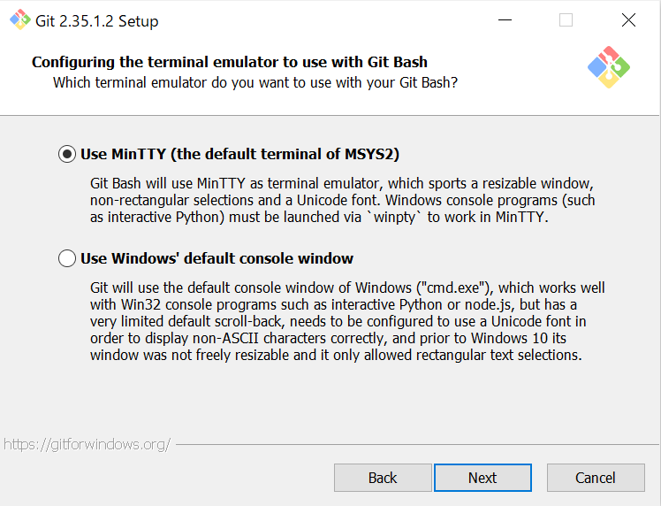

### 選択肢とその説明
> * Use MinTTY(the default terminal of MSYS2)<br>
> MinTTYを使用<br>
> * Use Windows' default console window<br>
> Windowsの標準コンソールを使用<br>

13. git pullの設定<br>
git pull でマージを行う際の挙動を選択します。<br>
(デフォルトの状態でOK)<br>
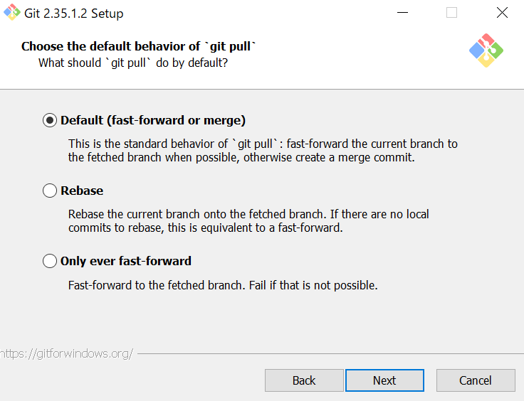

### 選択肢とその説明
> * Default(fast-forward or merge)<br>
> 「git pull --ff」 が実行される<br>
> * Rebase<br>
> 「git pull --rebase」 が実行される<br>
> * Only ever fast-forard<br>
> 「git pull --ff-only」 が実行される<br>

14. 資格情報マネージャー(Credential Manager)の選択<br>
インストールすると、httpsでリモートリポジトリに接続する際に毎回認証する手間が省けます。<br>
(デフォルトの状態でOK)<br>
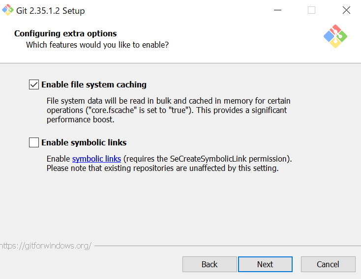


### 選択肢とその説明
> * Git Credential Manager<br>
> Credential Manager をインストール<br>
> None<br>
> Credential Manager を使用しない<br>

15. オプションの設定<br>
(デフォルトの状態でOK)<br>


### 選択肢とその説明
> * Enable file system caching<br>
> Git関連のファイルをキャッシュし、動作を速くします。その代わり、通常よりも多くのメモリーを使用します。<br>
> * Enable symbolic links<br>
> リポジトリ内でシンボリックリンクを使用したい場合にチェックします。<br>

16. 試験運用オプション<br>
(デフォルトの状態でOK)<br>
(基本的にチェックしない)<br>
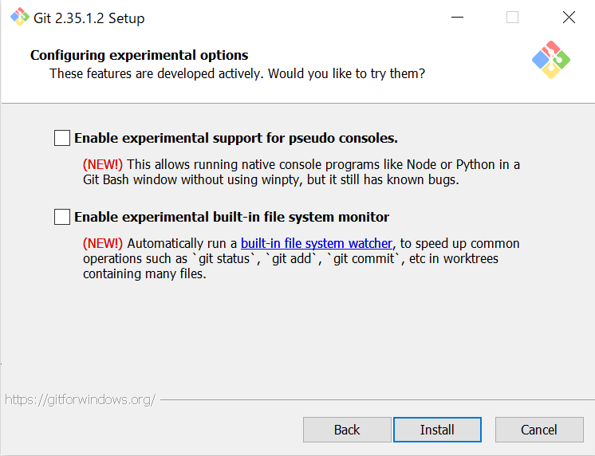

### 選択肢とその説明
> * Enable experimental support for pseudo consoles.<br>
> チェックをすると、Git Bash window 上で Python や Node のコンソールプログラムが動作するようになる<br>Enable experimental built-in file system monitor.<br>
> チェックをすると、ワークツリーに多くのファイルがある場合にGitコマンドが高速化する

17. インストール開始！<br>
インストールが完了したらFinishで終了

## Gitの初期設定

### Gitの基本コマンド
Gitコマンドの簡易ヘルプ(一覧など)が表示されるコマンド
```
git
```
Gitのバージョンを表示する
```
git --version
```

### ユーザー情報を登録しよう
Gitを使うには、名前とメールアドレスの登録が必要
```
git config --global user.name "名前"
git config --global user.email "メールアドレス"
```
登録情報を確認
```
git config --list
```


## GitHubのアカウント作成

1. 以下のリンクからGithubにアクセスしてください。<br>

### [GitHub](https://github.com/)

1. 新規登録フォームにユーザー名、メールアドレス、パスワードの登録<br>
(メールアドレスでの認証も忘れずに)

1. プラン選択で「free」を選択<br>
選択後、一番下の「continue」ボタンをクリック<br>


1. 以下のようなホーム画面に飛べばOK<br>
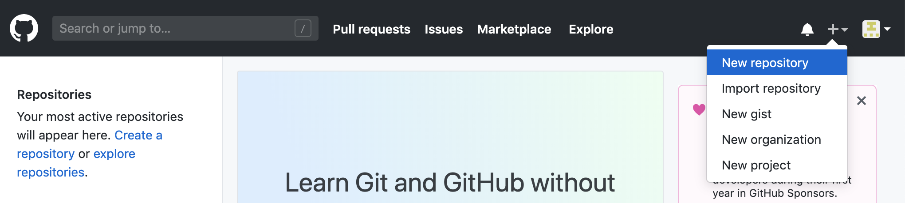


## 参考文献
[Progate](https://prog-8.com/docs/git-env-win)<br>
[Gitインストール](https://www.curict.com/item/60/60bfe0e.html)<br>
