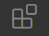
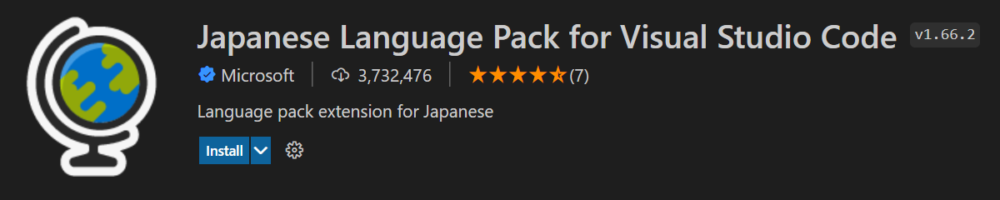

# VScodeで開発の準備をしよう

## VScode(Visual Stadio Code)のダウンロード
* [このリンク](https://code.visualstudio.com/)にアクセスして、自分のOS(学校推奨PCならWindows)にあったものをダウンロードする

### 以下の通りに進める
 

 

 
 

## VScodeの日本語設定

1. VScodeを立ち上げる

1. ExtensionsのUIをクリック(Ctrl+Shift+X) 

1. 検索欄でJapanese Languageと入力し、Microsoft社が出している以下の図のものをインストール 

1. VScodeを再起動する

1. 日本語化されていればOK
  

## 変更を自動保存されるようにしよう
1. ファイルのメニューから自動保存をクリック
2. 以下のようにチェックマークがついていればOK

