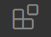
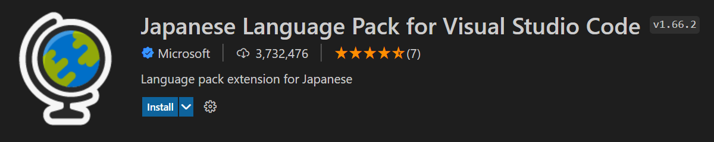
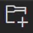
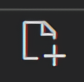

# VScodeで開発の準備をしよう

## VScode(Visual Stadio Code)のダウンロード
* [このリンク](https://code.visualstudio.com/)にアクセスして、自分のOS(学校推奨PCならWindows)にあったものをダウンロードする

### 以下の通りに進める
 

 

 
 

## VScodeの日本語設定

1. VScodeを立ち上げる

1. ExtensionsのUIをクリック(Ctrl+Shift+X) 

1. 検索欄でJapanese Languageと入力し、Microsoft社が出している以下の図のものをインストール 

1. VScodeを再起動する

1. 日本語化されていればOK
 

## VScodeに拡張機能を追加しよう(任意)

先程ついかしたJapanese Language Pack for Visual Stadio Codeも拡張機能の一つ  
同じようにして他の拡張機能も追加してみよう！

### オススメ拡張機能一覧
* Live Server
* Auto Rename Tag
* Auto Close Tag
* Highlight Matching Tag
* zenkaku
* indent-rainbow
 
## VScodeでフォルダとファイルを作成しよう

1. エクスプローラーのUIをクリック(Ctrl+Shift+E) 
 
 

1. フォルダと作成アイコンをクリックしてフォルダを作成 
 
 

1. ファイルを作成アイコンをクリックしてファイルを作成しよう 
 
 <b>HTMLファイルには.htmlという拡張子をつけよう</b> 
  <b>CSSファイルには.cssという拡張子をつけよう</b> 
 

1. 以下のような階層構造にする  
１番上のフォルダ(root) 
├CSSのフォルダ(css) 
　└ CSSのファイル(style.css) 
├HTMLのフォルダ(HTML) 
　└ HTMLのファイル(index.html) 
└画像のフォルダ(images) 
 

## 変更を自動保存されるようにしよう
1. ファイルのメニューから自動保存をクリック
2. 以下のようにチェックマークがついていればOK

