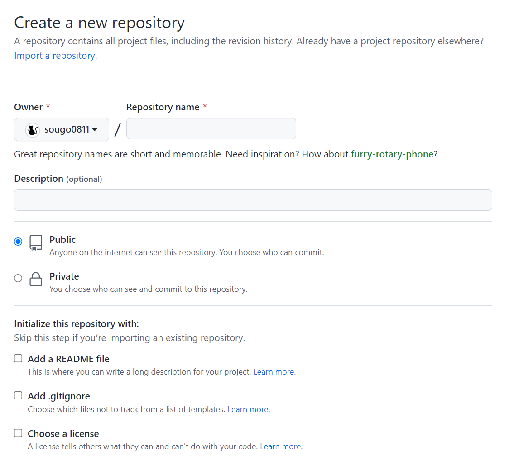

# オリジナルアプリ開発研修

この研修では、Ruby on Railsでオリジナルアプリを作成するための準備をします。

## 目次
1. [開発環境の確認](#開発環境の確認)
1. [プロジェクトの作成](#プロジェクトの作成)
1. [Git&GitHubを使って開発管理](#gitgithubを使って開発管理)
1. [アプリの開発目標](#アプリの開発目標)
1. [今後の研修日程](#今後の研修日程)
1. [過去の先輩たちの作品](#過去の先輩たちの作品)

## 開発環境の確認
  1. ターミナルでUbuntuを開いてください

  1. 以下のコマンドを入力してください
      * bashrcファイルの読み込み
        ```
        source ~/.bashrc
        ```
      * MySQLの起動
        ```
        sudo service mysql start
        ```

  1. 開発で使用したいRuby on Railsの環境が整ったディレクトリに入る

  1. Ruby,Rails,MySQL,Nodeが任意のバージョンが入っているか確認
      ```
      ruby -v && rails -v && mysql --version && npm -v
      ```

## プロジェクトの作成
  1. railsコマンドでアプリを作成
      ```
      rails new アプリ名 -d mysql
      ```
  
  1. アプリに入る
      ```
      cd アプリ名
      ```
  
  1. dotenv-railsのインストール
      * Gemfileを開く
        ```
        code Gemfile
        ```
      * Gemfileの一番下の行を改行して、以下のコマンドを書き込む
        ```
        gem 'dotenv-rails'
        ```

      * Gemに反映させる
        ```
        bundle install
        ```
  
  1. envの設定
      * .envファイルを作る
        ```
        touch .env
        ```
      * .envファイルを開く
        ```
        code .env
        ```
      * .envファイルに以下のことを書き込む
        ```
        DATABASE_USER=MySQLで作成したユーザー名入力
        DATABASE_PASS=MySQLで作成したパスワドを入力
        ```

  1. .envファイルがgitの管理下に入らないようにする
      * .gitignoreファイルに.envを追加する
        ```
        code .gitignore
        ```
      * gitignoreファイルの一番下の行を改行して以下を書き込む
        ```
        .env
        ```

  1. MySQLとRailsアプリを繋げる
      * database.ymlファイルを開く
        ```
        code config/database.yml
        ```
      * database.ymlファイルを書き換える
        ```
        username: root
        ```
        ↓↓↓↓↓↓↓↓↓↓↓↓↓↓↓
        ```
        username: <%= ENV['DATABASE_USER'] %>
        ```

        ```
        password:
        ```
        ↓↓↓↓↓↓↓↓↓↓↓↓↓↓↓
        ```
        password: <%= ENV['DATABASE_PASS'] %>
        ```

  1. MySQLでデータベース作成とマイグレーション
      * データベースの作成
        ```
        rails db:create
        ```
      * データベースのマイグレーション(反映)
        ```
        rails db:migrate
        ```
  
  1. Railsアプリの起動
      * 起動
        ```
        rails s
        ```
      * 検索エンジンで確認

        [ここ](localhost:3000)をクリック
        
      * Welcomeページが開かれればOK<br>
      Rails5系の場合は以下のようなページ<br>
      <br>
      Rails7系の場合は以下のようなページ<br>
      <br>


## Git&GitHubを使って開発管理
  1. gitが使えるか確認(バージョンが出ればOK)
      ```
      git --version
      ```
  1. 仮想環境でのgitのsshキーを作成(まだ作っていない方)
      * gitの初期設定
        ```
        git config --global user.name "ユーザー名"
        git config --global user.email "メールアドレス"
        git config --global core.quotepath false #日本語    ファイル名がエスケープされないように
        ```
      * .sshファイルに入る
        ```
        cd ~/.ssh
        ```
      * もし.sshディレクトリがmkdir ~/.sshで.sshディレクトリを作成する。
        ```
        mkdir ~/.ssh
        ```
      * sshキーを作成
        ```
        ssh-keygen -t rsa -C 'メールアドレス'
        #keyを作成するか聞かれるのでEnter
        #パスフレーズを入力
        #パスフレーズを再入力
        ```
      * GitHubに公開鍵を設定する
        生成した公開鍵(rsa.pub)をテキストエディタで開き、    中身を全てコピーします。 GitHubにアクセスし、下記    の手順通りに公開鍵を登録します。
    
        1. GitHubにログインし、右上のメニューから     Settings を選択
        1. SSH and GPG keys を選択
        1. New SSH Keyを押下
        1. Title(自由)、Key(コピーした内容をペースト)を入力して Add SSH keyを押下 以上でSSH接続の設定が完了です！
  1. プロジェクトをGitHubに上げる<br>
      * GitHubでリポジトリを作成する
        <br>

      *  自分がプロジェクト内にいることを確認
          ```
          pwd
          ```
      * プロジェクトをgithubにプッシュ
          ```
          git add .
          git commit -m "first commit"
          git remote add origin git@github.com:githubのusername/プロジェクト名.git
          git branch -M main
          git push -u origin main
          ```

## アプリの開発目標

今回皆さんには、約1ヶ月間でWebアプリを作ってもらいます。<br>
基本的には、自由にアプリを作ってもらって大丈夫です。<br>
ただし、最低限実装してもらいたい機能が3つあります。<br>
### 最低限実装してもらいたい機能
1. 新規作成,編集,削除の機能を持ったコントローラー
1. データベースにデータを登録＆データベースからデータを呼び出し
1. 追加機能(上記2項目以外の機能)

上記を満たしていれば、どんな機能を追加しても、ページレイアウトをこだわっていただいても構いません！<br>
オリジナリティあふれるアプリを作ってください！<br>

### 開発期限
開発期限は、8月1日(月曜日)から9月1日(木曜日)の1ヶ月間です。<br>
(すでにpaizaのRuby講座とRails講座が終わっている方は、開発を初めてもらって大丈夫です。)<br>
(まだpaizaのRuby講座とRails講座が終わっていない方は、7月31日までには必ず終わらせましょう！)<br>
<br>

## 今後の研修日程
基本的には、8月中は対面での研修を行いません。<br>
研修は行いませんが、アプリ開発の進捗確認は、1週間に1回は行います。<br>
進捗確認は、以下の方法で行います。<br>

### 進捗確認方法
1. 開発を行い、一段落ついたらGithubにPush(1週間に最低1回以上)(できれば毎回branchを分けてpull requestを立ててください)
1. 詰まったり、何か困り事、相談事等があれば、githubのissueに書いてSubmitしてください(issueはLabelなどを活用してタスク管理などに活用しても構いません)
1. 上記を見て、岡本が対面もしくは遠隔(Zoom)での進捗確認が必要だと感じた場合、進捗確認の日程をご連絡します。<br>
(また何か対面もしくは遠隔(Zoom)などで対応してほしい方がいらっしゃれば、岡本に連携してください)
<br>

## 過去の先輩たちの作品

* [木下先輩：EngineerDiary](https://engineerdiary.herokuapp.com/)

* [佐々木先輩：wabota](https://wabota2022.herokuapp.com/)

* [佐々木先輩：Stacker](https://stack-pick.herokuapp.com/)

* [酒尾先輩：TaskControl](https://task-control-app.herokuapp.com/)
