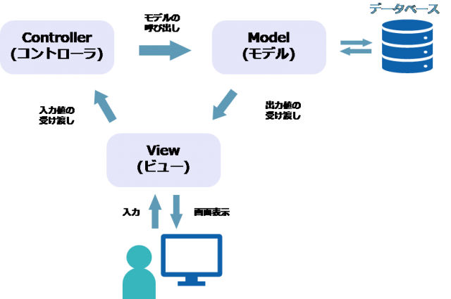

# はじめに

## Railsとは
Ruby on RailsとはRubyを使用したフレームワークで、2004年に、デンマークのプログラマであるデイヴィッド・ハイネマイヤー・ハンソン（通称DHH）氏によって作られました。 
簡単なコードでWebアプリケーションの開発ができるように設計されているのが特徴です 

## フレームワークとは
フレームワークとは、Webアプリケーション開発を行う際に必要となる機能や、基本的な骨組みをまとめたものです。あらかじめ完成している土台に、必要最低限のプログラムを書くだけでアプリケーションを作ることができます。 

### フレームワークのメリット
* 開発工程を短縮させられる
* コードの書き方が統一されることで、機能追加や改修が楽になる

### フレームワークのデメリット
* 枠組みが決まっているので、カスタマイズ性に劣る
* アプリケーションに搭載する機能によっては自分で一からコーディングする必要がある
* フレームワークを使うには使用方法そのものを勉強する必要があるため、学習コストが発生する

## Ruby on Railsの特徴
Ruby on Railsは、「MVCアーキテクチャ」に基づいて構築されたフレームワークです。それぞれ、Model（モデル）、View（ビュー）、 Controller（コントローラ）の頭文字をとって名付けられています。 
### MVCモデルとは
MVCモデルは、プログラムの処理を役割毎に分けて開発を行う考え方で、Webシステムの開発に頻繁に用いられています。 
以下の内容を一つのプログラムで行うことは可能ですが、わかりにくくなってしまいます。 

#### Model(モデル)
Modelは、主にデータベースとのやり取りや、システムの処理（ビジネスロジック）などを司る機能です。データベースから情報を取り出したり、書き込んだりする場合は、Modelに対して指示を与える必要があります。

#### View(ビュー)
Viewとは、画面（ブラウザ）への表示を司る機能で、html形式でブラウザにどんなページを表示するか定義づける役目を担っています。WebページやWebサービスの見た目（インターフェース）を決める際に欠かせない機能です。

#### Controller(コントローラー)
Controllerは、指令や指示を司る機能です。先に挙げたデータベースとのやり取りや、ブラウザへの反映は、ModelやViewに対してControllerが命令を与えることで初めて実行されます。

## Ruby on Railsでできること
Ruby on RailsはWeb開発向けのフレームワークとして設計されているため、Webアプリケーションを作るのに適しています。 
単純なWebサイトやSNSを初め、決済機能を備えたショッピングサイト、サイトからデータを取得するクローラーの開発などは、Ruby on Railsで作られることもできます。

### Railsが使われているWebアプリケーション

* [Twitter](https://twitter.com/)
* [クックパッド](https://cookpad.com/)
* [Airbnb](https://www.airbnb.jp/)